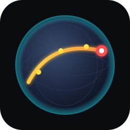

# AI DJ

Maps your music library into a vector DB ([Qdrant](https://qdrant.tech/)),
tags it with supervised genre classification ([Discogs-Effnet](https://essentia.upf.edu/models/)),
and plans listening paths through the resulting embedding space — visualised
in 3D, including a fractal planet you fly between songs.



---

## Quick start

You need:

- **Python 3.10 or 3.11**
- **[uv](https://github.com/astral-sh/uv)** — `curl -LsSf https://astral.sh/uv/install.sh | sh`
- **Docker or Podman** (for the Qdrant container)
- **A music library** — anything `librosa` decodes (mp3 / m4a / flac / wav / aac / ogg / opus). iTunes DRM (`.m4p`) is skipped.

Works on Linux, macOS, and Windows. CPU is fine — a CUDA GPU just makes the
embed step faster (auto-detected, nothing to configure).

```bash
git clone https://github.com/henris42/ai-dj && cd ai-dj
uv sync
./scripts/qdrant_up.sh
```

Download the genre tagger model files (~20 MB, one-time):

```bash
mkdir -p data/models && cd data/models
curl -LO https://essentia.upf.edu/models/feature-extractors/discogs-effnet/discogs-effnet-bs64-1.pb
curl -LO https://essentia.upf.edu/models/classification-heads/genre_discogs400/genre_discogs400-discogs-effnet-1.pb
curl -LO https://essentia.upf.edu/models/classification-heads/genre_discogs400/genre_discogs400-discogs-effnet-1.json
cd ../..
```

Index your library (the long part — a couple of hours for 10 k tracks on
CPU, faster on GPU):

```bash
uv run python scripts/build_index.py --library /path/to/your/music
uv run python scripts/tag_library_discogs.py
```

Run it:

```bash
uv run python -m ai_dj.gui.app
```

That's it. Window has a library browser, queue, "Up Next" panel,
genre-steer buttons, and a 3D visualizer (try **Planet**).

---

## Re-runs

`build_index.py` and `tag_library_discogs.py` both skip tracks they've
already done — re-run anytime you add music, no flags needed.

---

## Optional: AMD ROCm GPU

Default `uv sync` installs CPU/CUDA torch (whatever pip's wheel resolver
picks for your platform). If you have an AMD GPU and want it used by the
embed step, install ROCm-built torch on top:

```bash
uv pip install --index-url https://download.pytorch.org/whl/rocm6.4 \
  torch==2.9.1+rocm6.4 torchaudio==2.9.1+rocm6.4 pytorch-triton-rocm
```

For ROCm on **WSL2** specifically (RX 7000-series), there are a couple of
extra steps:

- ROCm 6.4 user-space (no `rocm-dkms` — WSL uses a kernel shim). Follow the
  [official guide](https://rocm.docs.amd.com/projects/install-on-linux/en/latest/install/3rd-party/wsl.html)
  but skip `usecase=wsl` (broken at time of writing).
- Swap the HSA runtime: `sudo cp /usr/lib/wsl/lib/libhsa-runtime64.so* /opt/rocm/lib/`.
- The embed script auto-sets `TORCH_ROCM_AOTRITON_ENABLE_EXPERIMENTAL=1` —
  without it SDPA hangs on gfx1101 with batched input.

Sanity check: `uv run python scripts/gpu_smoke.py`.

---

## Optional: Native Windows GUI (with WSL backend)

WSL's audio (WSLg) glitches under crossfades, so on Windows you can keep
Qdrant + indexing in WSL but run the GUI natively:

```powershell
cd C:\path\to\ai-dj
uv sync --no-dev
.\install-shortcut.ps1     # adds "AI DJ" to the Start menu
```

`launch.ps1` boots Qdrant in WSL, waits for it, and surfaces failures as a
Windows MessageBox. Full log in `data/launch.log`. After launching once,
right-click the running window's taskbar icon → Pin to taskbar to keep it.

---

## Layout

```
src/ai_dj/
    scan.py            walk library, mutagen tag read
    embed.py           MERT encoder, batched
    index.py           Qdrant collection wrapper
    discogs_tag.py     supervised Discogs-Effnet tagger
    clap_tag.py        legacy CLAP zero-shot tagger (kept for reference)
    path.py            path planner — context-aware cosine-neighbour walk
    projection.py      UMAP fit, cached to data/projection.npz
    styles.py          12 high-level genre buckets
    player.py          python-mpv wrapper, optional crossfades
    gui/app.py         PySide6 GUI
    visualizers/       plug-in 3D modes; @register-decorated classes
scripts/
    build_index.py            scan + embed
    tag_library_discogs.py    tag with Discogs-Effnet
    qdrant_up.sh / qdrant_down.sh
data/                  gitignored: embeddings, models, logs, qdrant volume
```

Add a visualizer: drop a module in `src/ai_dj/visualizers/` with a class
decorated `@register`. The GUI auto-discovers it. See `landscape.py` for a
non-trivial example (the planet).
